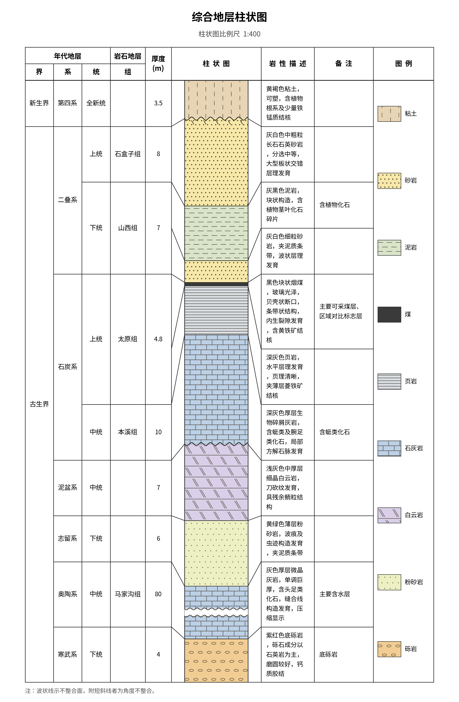

# 地层绘图 Server + Web

用 Python + matplotlib 绘制大学地质学常用的**综合地层柱状图**和**地层剖面图**，
由同域 HTTP Server 提供浏览器界面和绘图 API，也保留命令行批量出图及旧版
Tkinter 桌面界面。



## 安装

- Python 3.8+
- 系统需装有中文字体（Noto Sans CJK / 微软雅黑 / 黑体等，自动检测）

```bash
python3 -m venv .venv
. .venv/bin/activate                 # Windows: .venv\Scripts\activate
python -m pip install -r requirements.txt
```

只有运行旧桌面界面才需要 tkinter（Debian/Ubuntu：`apt install python3-tk`）。
Server 与 Web 前端使用 Python/浏览器标准库，不需要 Node.js，也没有前端构建步骤。

## 使用

### Server + Web（默认）

```bash
python3 app.py
# 等价于：python3 app.py serve --host 127.0.0.1 --port 8000
```

打开 <http://127.0.0.1:8000>。若需让局域网其他设备访问：

```bash
python3 app.py serve --host 0.0.0.0 --port 8000 --allow-network
```

非回环监听必须显式加 `--allow-network`；可重复使用 `--allowed-host 主机名或IP`
限制浏览器 `Host`。内置服务没有账号认证和 TLS，跨越可信局域网时请放在带
HTTPS/认证/限流的反向代理之后，并配合防火墙限制来源。

浏览器界面分三块：左侧**模式栏**切工作区，中间**图纸**，右侧**属性检查器**。
层级即结构——**工作区 › 分组 › 控件**，改任何参数都即时重绘。

**图件**工作区画你的数据，检查器分组：

- **数据源**：打开数据 / 重新载入 / 两个示例 / 下载模板。**打开哪种数据
  就画哪种图**——有“钻孔”列即按剖面图识别，否则按柱状图，不必先声明类型
- **图面**：图名、页面与横向、比例尺、字体、字号、主图花纹层厚；剖面图则为
  垂直夸大系数。主图花纹层厚默认 2.5 mm，可在 1–10 mm 间调整；
  图例使用独立的标准代表样式
- **栏目内容**（柱状图）：厚度栏显示（**按组总厚度 / 逐层厚度 / 地层深度
  三选一**）、备注栏、图底 GB/T 958 花纹图例、单位竖排
- **地层单位列**（柱状图）：先勾类别（地质年代 / 年代地层 / 岩石地层），
  其下各列缩进列出、随父类别一起启用或置灰；**当前数据没有的类别不出现**
- **栏宽**（柱状图）：各栏厘米数，带范围提示与“恢复默认”

**花纹库**工作区管岩性花纹：左边“常用岩性一览 / 基本图形一览 /
**国标图例库**”三个视图（国标图例库按大类下拉切换，见下），右边
**花纹设计器**——逐行选基本图形、调厚度与底色、实时预览，“应用到
图件”即绑定到该岩性并立即重绘，也可存成样式文件。

**不适用于当前数据的分组直接隐藏**（如载入剖面图时不出现栏宽/栏目内容），
不留置灰的死控件。底部状态栏显示提示与当前数据概况。图纸可缩放
（**Ctrl+滚轮**，或底部“－ / ＋ / 适应窗口 / 100%”）——缩放只改显示密度，
**不影响页面规格与导出**。**性能**：数据读入即缓存，改任何参数都用缓存
重绘，不再重复读取 Excel。快捷键：Ctrl+O 打开、Ctrl+E 导出、
Ctrl+1 / Ctrl+2 切换工作区、Ctrl+0 适应窗口。

服务把上传内容解析为带随机 ID 的临时内存文档，不接受客户端传入服务器
文件路径；文档会过期清理。预览用较低 DPI，PNG/PDF/SVG 导出会按选择的
DPI 重新绘制。样式随请求隔离，不会串到其他浏览器会话。

### 旧版桌面界面

```bash
python3 app.py gui
```

桌面界面仍保留，便于离线兼容；新功能和部署入口以 Web 版为准。

### 命令行

```bash
python3 app.py column examples/column_demo.xlsx -o 柱状图.png --scale 200
python3 app.py column examples/column_demo.xlsx -o 柱状图.pdf --page A3   # 矢量 PDF
python3 app.py section examples/section_demo.xlsx -o 剖面图.png --ve 2
python3 app.py patterns -o 岩性花纹一览.png            # 导出所有花纹对照表
```

- `--scale`：柱状图垂直比例尺分母（如 200 = 1:200），缺省自动按页面高度选取
- `--page`：页面规格 A0–A5 / B3–B5 / 8开 / 16开 / 信纸 / 法律纸，或自定义
  `24x36`（厘米），默认 A4；`--landscape` 页面横向
- `--font`：中文字体名（如 SimHei）；`--font-size`：正文基准字号 6–12 pt
- `--pattern-row-height-mm`：柱状图/剖面图主体内置层状花纹的基础层厚，
  范围 1–10 mm，默认 2.5；不改变图例小样的代表性绘法
- `--strata`：只显示指定类别的地层单位列（`geochron` 地质年代 /
  `chrono` 年代地层 / `litho` 岩石地层，可多选）
- `--hide-units`：单独隐藏某些地层单位列（中文名，如 `统 段`），
  在 `--strata` 之上细化到某一列
- `--depth`：厚度栏改为显示地层深度；`--thick-per-layer` 逐层厚度；
  `--unit-vertical` 单位文字竖排；`--legend` 在图底加 GB/T 958 花纹图例
- `--ve`：剖面图垂直夸大系数，缺省自动适配画幅
- `--style`：自定义样式 JSON（见下）；`--title` 图名；`--dpi` 分辨率（默认 300）
- 输出格式由扩展名决定：`.png` 位图、**`.pdf` / `.svg` 矢量图**（打印推荐 PDF）

### HTTP API

Web 界面使用以下同源接口；上传接口的请求体就是原始文件字节，文件名放在
查询参数中，因此不需要 multipart 依赖：

| 方法 | 路径 | 用途 |
|------|------|------|
| GET | `/api/v1/health` | 健康检查 |
| GET | `/api/v1/capabilities` | 页面、字体、栏宽、图形及国标类别 |
| POST | `/api/v1/documents?filename=数据.xlsx` | 上传并解析数据 |
| POST | `/api/v1/examples/{column\|section}` | 打开内置示例 |
| POST | `/api/v1/documents/{id}/render` | 预览或导出 PNG/PDF/SVG |
| DELETE | `/api/v1/documents/{id}` | 释放临时文档 |
| GET | `/api/v1/templates/{column\|section}` | 下载 Excel 模板 |
| POST | `/api/v1/sheets/render` | 输出花纹、基本图形或国标分类表 |
| POST | `/api/v1/patterns/preview` | 预览自定义花纹 |

服务默认仅监听回环地址且不启用跨域。上传上限 10 MiB；样式和设置均作为
请求数据传递。默认还会校验 Host/Origin、限制并发线程、请求读取时间、解析后
文档内存和渲染像素/输出大小。错误统一返回
`{"error":{"code":"…","message":"…"}}`，响应头中的 `X-Request-ID` 可用于
对应服务日志。

图件渲染请求可在 `options` 中传入
`"pattern_row_height_mm": 3.5`；两种图都支持，范围 1–10，缺省 2.5。

### WSL 直接运行

```bash
cd /mnt/dizhizuotu
/usr/bin/python3 app.py serve --host 127.0.0.1 --port 8000
```

Windows 浏览器访问 <http://127.0.0.1:8000>。WSL 2 默认支持 Windows 到
WSL 的 localhost 转发，无需容器或额外端口映射。若系统 Python 尚未安装
依赖，先执行 `/usr/bin/python3 -m pip install -r requirements.txt`。

## 数据格式（推荐 Excel .xlsx，也支持 CSV）

**Excel 标准格式**（模板见 [examples/column_demo.xlsx](examples/column_demo.xlsx)
与 [examples/section_demo.xlsx](examples/section_demo.xlsx)，可直接复制修改）：

- 数据工作表的**第一行是表头**，数据从第二行起；工作簿可有封面/说明页，
  程序会扫描所有工作表并选择含关键表头且有数据的那一张
- 列的先后顺序不限，按列名识别；列名带单位也可以（如"厚度(m)"）
- 厚度/距离/标高等可以是数值或文本格式，均能识别
- **纵向合并单元格没问题**：地层单位按层合并、钻孔信息按孔合并，
  读取时自动展开（示例文件就是合并的写法）
- 为防止恶意或损坏工作簿耗尽内存，会在载入前限制工作表维度、有效单元格、
  合并区域数量和总面积；超限文件会直接给出格式错误，不会进入绘图阶段
- 公式单元格读取 Excel 文件中已保存的缓存结果；请先在表格软件中重新计算
  并保存。旧版 `.xls` 请另存为 `.xlsx`
- CSV 同样的列结构，支持 UTF-8 / GBK 编码

### 柱状图：每行一层，自上而下

| 界 | 系 | 统 | 组 | 岩性 | 厚度 | 描述 | 备注 | 接触关系 |
|----|----|----|----|------|------|------|------|----------|
| 古生界 | 石炭系 | 上统 | 太原组 | 煤 | 0.3 | 黑色块状烟煤…… | 主要可采煤层 | |

**地层单位列**可任选以下三类各级（有数据的列才显示，按等级自动排列、
相邻同名自动合并单元格，并按类别加“地质年代 / 年代地层 / 岩石地层”
分组表头）：

| 类别 | 各级单位（大→小） |
|------|-------------------|
| 地质年代（时间单位） | 宙 代 纪 世 期 |
| 年代地层 | 宇 界 系 统 阶 |
| 岩石地层（地质地层） | 群 组 段 |

只有“岩性”“厚度”必填。可用 `--strata`（GUI“地层单位列”分组里的三个
类别复选框）只显示某一或某几类，例如只出年代地层或只出岩石地层；
还能用 `--hide-units 统 段`（GUI“地层单位列”分组里逐列勾选）**精确到
单独某一列**的显隐，在类别筛选之上再细化。
也兼容旧格式的“地层单位”单列写法；“备注”整列为空时不显示该栏。

图面栏目：**地层单位各列｜厚度/深度｜柱状图｜岩性描述｜备注**。
单位文字默认横排，`--unit-vertical`（GUI“栏目内容 › 单位竖排”）改为竖排。

**一个组可包含多层岩性**：连续多行填同一组名即可（如山西组下泥岩、
砂岩两行）。厚度栏有三种显示，用开关切换：
- 默认按组合并显示**总厚度**
- `--thick-per-layer`（GUI“栏目内容 › 厚度栏显示”选“逐层厚度”）逐层
  显示每种岩性厚度
- `--depth`（同处选“地层深度”）改为**地层深度**：在各组交界处标注从
  顶界起算的累计深度（表头随之变为“深度(m)”）

### 剖面图：每行一个钻孔的一层，层自上而下

| 钻孔 | 距离 | 孔口标高 | 层号 | 岩性 | 厚度 | 接触关系 |
|------|------|----------|------|------|------|----------|
| ZK1 | 0 | 46.8 | 1 | 填土 | 1.2 | |

同一**层号**在各钻孔间连线对比；某钻孔缺某层号即视为该层**尖灭**。
钻孔会按距离排序，各孔的自上而下层序共同建立统一层序；若层序互相矛盾会
明确报错。相同层号在不同钻孔出现不同岩性时按孔间区段表达侧向相变，接触
关系不一致时也分段绘制，不再用多数岩性或第一项覆盖。

### 版式与薄层长描述

默认版式（勘察柱状图风格）：**岩性柱按比例尺绘制**，其余各栏的
行高由该层文字内容决定（描述/备注取所需较大者），**两侧以折线连接
表格行界与岩性柱层界**——薄层的长描述天然有足够行高，永不截断；
自动比例尺取岩性柱总高与表格总高匹配的常用值，底部通过行距拉伸
自动对齐。厚层折断只压缩被标记且确有版面缺口的候选层，未压缩层始终
保持图上标注的真实比例。

加 `--to-scale` 使用旧版式（教材风格，所有栏与岩性柱严格按深度
对齐）：此时薄层长文字自动移到层外空位并画引线指回，自动比例尺
保证不截断，仅人为指定过小比例尺时降字号乃至截断并加注提示。

### 页面、图名、比例尺与字体

- **页面大小**：`--page A4/A3/B3/…/信纸`，或自定义 `24x36`（厘米），
  `--landscape` 横向；当前单页/连续长图模式以页面宽度为硬约束，自动比例尺
  会尽量使图高贴合页面，文字放不下时以内容为准并允许画布向下延长
- **图名/比例尺**：`--title`、`--scale`；GUI 在“图面”分组里改
- **字体**：`--font 宋体`——支持中文名：宋体/新宋体/黑体/仿宋/楷体/
  微软雅黑/等线/隶书/幼圆/华文宋体/华文楷体/华文仿宋/华文行楷等
  （也接受族名如 SimHei）；GUI 下拉按中文名列出系统实际安装的字体；
  `--font-size` 正文基准字号 6–12 pt，表头/标题按其加成缩放

### 柱状图栏宽调整（单位：厘米）

各栏宽度可自由调整，超出允许范围会**自动夹紧**：

| 栏名 | 默认 | 允许范围 |
|------|------|----------|
| 各地层单位列（宙代纪世期/宇界系统阶/群组段） | 1.3 cm（岩石地层 1.6） | 0.4 – 4.0 cm |
| 地层单位（旧格式单列） | 2.2 cm | 0.6 – 5.0 cm |
| 厚度 | 1.2 cm | 0.4 – 3.0 cm |
| 连接带（两侧折线区） | 0.6 cm | 0.2 – 1.2 cm |
| 柱状图 | 2.9 cm（对齐版式 3.8） | 1.0 – 8.0 cm |
| 备注 | 2.7 cm | 0.8 – 6.0 cm |
| 图例项（开启时） | 按最长岩性名自动 | 1.8 – 6.0 cm |

“岩性描述”栏是其余各栏的**余量**，不能直接设置，但保证不小于
1.5 cm（其余栏设得过宽时按可压缩量自动回压）；描述/备注文字按全角
1 em、半角 0.55 em 精确计宽折行，行宽随栏宽实时变化。

- 命令行：`--width 柱状图=3.5,备注=2.0`（可多次、逗号分隔）
- 图形界面：检查器“栏宽”分组，改完即时重绘，“恢复默认”一键还原

### 不整合面（接触关系列，可选）

“接触关系”指该层与**下伏层**的接触：写“平行不整合”时该层底界画
**波状线**，写“角度不整合”时波状线下方另加**短斜线**（示下伏地层被
削截），留空即整合接触（直线）。直线、波状线及短斜线最多保留 0.35 mm
白色隔离净空，薄层中会按图上层高自动收窄，既避免与花纹混线，也不吞没
薄层图案；剖面中相邻钻孔标注不一致时，接触类型会在孔间中点连续分段。

### 岩性图例（GB/T 958 花纹，可选）

`--legend`（GUI 勾选“栏目内容 › 岩性图例”）在主表下方增加紧凑的
岩性图例块，按岩性在数据中**首次出现的顺序**行优先阅读。
宽度不足时整项换行，各行均衡分配并居中，不再留下孤立末行。
图例不再挤窄岩性描述栏，关闭时不占版面。

- **图版样框**：参照 GB/T 958—2015 表 4 正式图版，样框固定为
  **15 mm × 10 mm**、黑色方框；条目增多时只换行，不缩小或拉伸样框
- **代表小样**：GB/T 958—2015 表 4 图版中，常规砂岩、砾岩、灰岩等
  以 3 个重复层带表示，因此图例小样固定显示 3 个代表单元；页岩式
  密集连续底纹保留标准密度，不错误强制为 3 条线
- **与主图解耦**：“主图花纹层厚”只调整柱状图/剖面图内的平铺层高；
  设为 1、2.5 或 10 mm 时，同一岩性的图例小样始终一致
- **完整名称**：参照宽图底部图例，名称置于样框下方，最多两行；
  括号与标点不拆散、文字不截断，“图例项”宽度可设为 1.8–6.0 cm
- **设色说明**：图例明确说明填充色仅用于辅助区分岩性，地质含义以花纹
  与名称为准，符合标准附录 A 对按岩类设色时应说明方法的要求
- **自适应布局**：能容纳时单行；项目多时按可用宽度整项换行、均衡分配，
  不把“整个图例的行数”与“单个小样内的重复层数”混为一谈

### Excel 数据模板下载

检查器“数据源 › 下载数据模板…”把内置的**空白模板**（柱状图模板.xlsx /
剖面图模板.xlsx，已随程序打包）另存到任意文件夹。模板里只有**表头**
和几行**【示范】数据**——请把示范行**替换成你自己的数据或删除**，
不要保留示范行，否则绘图时会把示范数据一起画出来（这也是“导入后
既有示例又有自己数据”的常见原因）。填好后用“打开数据…”载入即可。
数据表可以不在第一张工作表——程序会自动找到含“岩性/厚度/钻孔”等
关键列的那张表，封面/说明页放在前面也没问题。

### Windows 高分屏优化

程序开启了 DPI 感知：在 125%/150% 缩放的高分屏上界面**清晰不模糊**，
并按屏幕 DPI 自动放大窗口与字号，控件不再显得又小又糊。

### 厚层压缩显示（压缩列，可选）

单调巨厚的地层（如厚层灰岩、砂岩）可用**地质柱状图标准的折断压缩
表示**：在数据里加一列“**压缩**”，某层填“是”（或 Y/√）即允许程序
在空间不足时省略该层。页面与文字表格能容纳自然柱高时完全不压缩；确实
超出时只缩短刚好需要的高度，并在最终仍被缩短的层中部画一对
**折断波状线**。多个候选厚层按各自可压缩余量同比例分担，单层最低保留
0.95 英寸以保证花纹和折断符号可辨。**厚度栏仍标注真实厚度、深度模式
仍按真实深度累计**；未标记层始终保持标注比例尺，不会为了填空白而拉伸
或压短。压缩能力仍不足时画布会自然加长，而不会继续扭曲其他地层。

## 支持的岩性（内置 90 余种基础花纹 + 成分修饰自动组合）

岩石花纹按 **GB/T 958—2015《区域地质图图例》** 表 4（岩石花纹图例）、
表 5（矿物矿层图例）与附录 A（花纹设计原则及组合方法）绘制：符号
形状、宽×高毫米数、排列方式（沉积岩横向交错、松散堆积物纵向要素、
变质岩横向波状线）均取自标准的制图参数——成岩碎屑岩带水平层理线、
层间符号隔层错半格（砾岩为层理线加 2×1 mm 扁椭圆、角砾岩为层理线
加 1.5×1.5 mm 空心三角、粉砂岩为层理线加成对细点）、泥灰岩层间
通高单斜节理、白云岩通高双线斜节理、大理岩砖形加双线竖节理、
闪长岩 ⊥、正长岩 ⊤、辉长岩 X、玄武岩 Γ、安山岩 ∨、粗面岩 工、
花岗岩长石十字与细十字相间、板岩粗细波状双线、千枚岩波状虚线、
石膏梳形符等。分五大类内置：

- **松散堆积物**：粘土、粉土、砂土（粗/中/细/粉砂分级）、淤泥、
  填土、黄土、红土、碎石土、泥炭土、贝壳层、冰碛、漂砾……
- **第四纪覆盖物（成因类型）**：冲积、洪积、冲洪积、坡积、残积、
  残坡积、崩积（地滑堆积）、风积、湖积、海积、沼泽堆积、冰水堆积、
  化学堆积——如"冲积砂砾""坡积碎石"这类"成因+岩性"名称按**岩性
  优先**取花纹，只写成因时用成因花纹兜底
- **沉积岩**：砾岩（巨/中/细砾分级）、砂砾岩、角砾岩、砂岩（粗/中/
  细粒及石英/长石砂岩）、粉砂岩、泥岩、页岩、油页岩、石灰岩及其
  变种（结晶/生物/鲕粒/竹叶状/礁/燧石条带灰岩）、白云岩、泥灰岩、
  白垩、硅质岩、煤……
- **岩浆岩**：橄榄岩、纯橄榄岩、金伯利岩、辉石岩、角闪石岩、辉长岩、
  辉绿岩、玄武岩、安山岩、闪长岩、花岗闪长岩、花岗岩、正长岩、
  二长岩、斜长岩、流纹岩、英安岩、粗面岩、响岩、凝灰岩、玢岩、
  斑岩、伟晶岩、细晶岩、煌斑岩、珍珠岩、黑曜岩、浮岩、碳酸岩……
- **变质岩**：板岩、千枚岩、片岩、片麻岩、石英岩、大理岩、角岩、
  矽卡岩、变粒岩、麻粒岩、榴辉岩、蛇纹岩、糜棱岩、碎裂岩、
  构造角砾岩、混合岩、混合花岗岩……
- **化学岩**：石膏、岩盐

**成分修饰自动组合**（GB/T 958 的组合规则）：岩性名为“修饰词+基础
岩性”时自动在基础花纹上叠加修饰符号——硅质(Si)、钙质(∟)、铁质(Fe)、
碳质(C)、泥质、砂质、粉砂质、白云质、凝灰质、含砾、含铜(Cu)、
含磷(P)、含锰(Mn)、含钾(K)、铝土(Al)、含油、鲕状、瘤状、角砾状、
条带状等。因此“硅质页岩”“钙质砂岩”“泥质粉砂岩”“含铜砂岩”这类
数百种组合名都能直接识别并生成正确花纹。

岩性名支持模糊匹配（如“灰白色中粒长石石英砂岩”自动识别为长石砂岩
类）。每种花纹图形唯一，色觉障碍或黑白打印仍可分辨。运行
`python3 app.py patterns`（或 GUI 的“花纹库”工作区）查看/导出常用花纹
对照表。

## GB/T 958—2015 岩石花纹图例全集（910 项，分类收录）

标准表 4 的**全部**岩石花纹图例已完整收录（含标准代码，如
`RPSE021001`），按标准分类体系组织为 11 大类：

| 类别 | 项数 | 内容 |
|------|------|------|
| 基本花纹 | 86 | 成分·结构·构造符号（4.4.1，组合体系的基础） |
| 沉积岩 | 128 | 角砾岩/砾岩/砂岩/粉砂岩/页岩/泥岩/黏土岩/灰岩/白云岩全系 |
| 松散堆积物 | 34 | 砾石/砂/黄土/黏土/淤泥/泥炭/贝壳层/人工堆积等 |
| 侵入岩 | 104 | 超基性→酸性→碱性、煌斑岩、碳酸岩七小类 |
| 火山熔岩 | 55 | 超基性→碱性熔岩五小类 |
| 火山碎屑岩 | 288 | 流纹质/英安质/粗面质/安山质/玄武质等 10 个成分系列 × 集块/角砾/凝灰/熔结/沉积组合 |
| 脉岩 | 8 | 彩色透镜表示（超基性墨绿…酸性红、碱性橙） |
| 变质岩 | 144 | 板岩/千枚岩/片岩/片麻岩/麻粒岩/大理岩/榴辉岩/角岩/矽卡岩等 12 小类 |
| 蚀变岩 | 36 | 红色花纹＋蚀变代号（Sk、Si、Py……，标准表示法） |
| 构造岩 | 14 | 压碎角砾岩、碎裂岩、糜棱岩系列 |
| 混合岩 | 13 | 眼球状、香肠状、条带状等 |

花纹按附录 A《岩石花纹设计原则及组合方法》规则式生成：基岩符号＋
成分/结构附加符号组合、火山碎屑岩＝化学成分符号＋碎屑符号、
熔结加波折号、斑状粗细相间——与标准的构成逻辑一致。

- **数据里直接写标准岩石名**即可出图：“流纹质晶屑玻屑凝灰岩”
  “石榴黑云片岩”“透辉石大理岩”“眼球状混合岩”“黄铁矿化”……
  全部 900 余个名称开箱即用，岩性图例同步显示
- **GUI**：花纹库 › “国标图例库”，按大类下拉浏览（带小类分节标题），
  可直接导出当前类别的图例表；每项显示完整名称和标准代码，不再截断长名称
- **命令行**：`python3 app.py catalog` 导出全部 11 类（每类一张图）；
  `-c 变质岩` 只导出一类；`--list` 列出类别

图例大全中的沉积构造、化石、产状等**点状标注符号**不属于地层充填
花纹，暂未收录。

## 自定义花纹与样式（无需改代码）

准备一个 JSON 文件即可增改颜色、花纹、名称匹配。放在**数据文件同
目录 / 当前目录 / 程序目录**并命名 `strat_style.json` 会被自动载入，
也可用 `--style 文件` 指定；GUI 在“花纹库 › 样式文件 › 载入样式…”，
改完即时重绘。
样式会先全量校验，只有全部定义和引用都正确才一次性生效；零/负/NaN 间距、
过深或过大的花纹会在绘图前拒绝。旧桌面端向已有样式文件追加时使用原子替换，
并在同目录保留一个 `.bak` 备份，损坏 JSON 不会再被当成空文件覆盖。
完整示例见 [examples/strat_style.json](examples/strat_style.json)：

```json
{
  "patterns": {
    "我的花纹": [
      { "type": "brick",   "spacing": 2.4, "ratio": 2.4 },
      { "type": "markers", "marker": "o", "spacing": 2.8, "filled": false }
    ]
  },
  "lithology": {
    "含砾泥岩": { "color": "#d7d2b0", "pattern": "我的花纹" },
    "石灰岩":   { "color": "#bcd0e6" }
  },
  "aliases": { "含砾泥岩": "含砾泥岩" }
}
```

- **patterns**：自定义花纹，由“图元”叠加而成，每个图元一个字典：
  - `{"type":"lines","angle":45,"spacing":1,"dash":0,"gap":0,"offset":0,"phase":0,"origin":0.5}`
    一族平行线（角度°、间距倍率、虚线段长/间隔倍率、隔行错位；
    `phase` 虚线起始相位——两层错相可叠出点划线；`origin` 线族相对
    包围盒边的相位，层理式花纹取 0 使层间符号恰好居中、层带完整）
  - `{"type":"markers","marker":".","spacing":1,"xspacing":0,"size":2,"filled":true,"stagger":true,"xoff":0,"yoff":0}`
    点阵符号（`marker` 取 `.` `o` `+` `x` `v` `^` `s` `*` `d` `D` `|` `_` 等；
    `xspacing` 横向间距倍率，缺省与 `spacing` 相同——层理式花纹行距
    与行内符号间距不同时用）
  - `{"type":"brick","spacing":2.2,"ratio":2.2,"slant":0,"double":0,"jdouble":0,"jshort":0}`
    砖形（层高倍率、砖宽/层高、节理斜率；`double` 层面双线间距 mm，
    `jdouble` 节理双线间距 mm——白云岩式双斜线/大理岩式双竖线，
    `jshort` 节理上下缩短比例）
  - `{"type":"wave","spacing":1,"amp":0.25,"wavelength":1.2,"dash":0,"gap":0,"yoff":0}`
    水平波状线（`yoff` 纵向偏移 mm，双波状线/虚实相间用）
  - `{"type":"shape","shape":"椭圆","w":2,"h":1,"spacing":2,"xspacing":0,"tilt":0,"bold":false,"stagger":true,"xoff":0,"yoff":0}`
    **标准图形阵**：按 GB/T 958 制图参数以毫米精确绘制的矢量符号，
    不依赖字体。`shape` 可选：椭圆、三角、直角三角、菱形、十字、
    长石十字、X形、T形、倒T形、工形、Γ形、L形、N形、人字、V字、
    斜线、双斜线、上/下/左箭头、梳形、方框、波折线、S形、贝壳形、
    螺形、拱形、蛇纹符、燧石符、竖条、横条、三竖、黑曜符、圆加尾、
    油页符、实心透镜；`tilt` 旋转角，`bold` 加粗，`xoff/yoff` 网格
    相位（相间排列两种符号时错半格）
  - 线类图元（lines/brick/wave/ell/shape）均可加 `"lw": 1.2` 指定
    线宽（磅），粗线花纹（泥炭土编织纹、板岩粗波线等）用
- **lithology**：设某岩性的 `color`（底色）和/或 `pattern`（花纹名，可
  引用内置或自定义花纹）；只给其一则另一项沿用原值
- **aliases**：`"关键字":"标准岩性名"`，优先于内置匹配

写法上还允许：花纹值直接写**单个图元字典**（不必套列表）、直接写
**基本图形的中文名**（如 `"我的花纹": ["横线", "中点"]`），以及它们的
混合列表。载入时**逐项校验**——图元类型或参数名写错、颜色不合法、
引用了未定义的花纹、别名指向不存在的岩性，都会在载入时给出**指明
位置的中文报错**（GUI 状态栏/弹窗可见），而不是绘图时的一句
`TypeError`。下划线开头的键（如 `"_说明"`）当注释忽略。

所有尺寸以英寸为基准，不同比例尺下疏密自动一致；角度按真实几何
计算。柱状图、剖面图和图例共用同一物理间距；内置层状花纹的基础层厚
默认 2.5 mm，可按单张图设为 1–10 mm，厚层通过增加重复层数表达。不足
一个完整节距的余量会对称留在上下边界，同一岩性横跨多个钻孔区段时连续
铺纹。行式自定义花纹仍使用设计器中逐行设置的瓦片高度，不会被这一全局
图面参数改写。内置岩性也是用同一套引擎定义的，改起来完全一致。

### 用基本图形按行拼花纹（行式瓦片）

除了图元叠加，还可以像搭积木一样**按行拼一个瓦片**再自动横纵重复
平铺——这是设计新花纹最直观的方式：

```json
"我的分层花纹": [
  { "type": "rows", "spacing": 1.3,
    "heights": [1, 1, 2],
    "rows": ["横线", "中点", "空心圆"] }
]
```

`rows` 是一个“行式瓦片”图元：`rows` 列出**每一行的图形**（自上而下），
`heights` 是**每行的相对厚度**，`spacing` 控制整个瓦片的高度。瓦片
沿岩性柱**纵向重复**、每行内图形**横向重复**填满。行内容可写：
- **基本图形的中文名**（如 `"横线"`、`"空心圆"`）——内置约 45 种
  基本图形：点/圈类、横/竖/斜/网格线、十字/叉/星/三角/方块/菱形/
  短横短竖/V形、波浪线、砖纹、空白等；
- 或直接写图元字典、或它们的列表（一行叠多种图形）。

运行 `python3 app.py shapes` 导出**基本图形一览**，照着挑图形按行
组合即可。示例见 [examples/strat_style.json](examples/strat_style.json)
的“我的分层花纹”。

**Web 界面里可视化设计**（推荐）：切到左侧“**花纹库**”工作区，右边就是
花纹设计器——逐行选基本图形（下拉）、填每行厚度、设瓦片高度与底色
（可点色块取色），面板内会实时显示**柱内平铺预览**；行可上移/下移/
删除。“用于岩性”在已载入数据时可**直接下拉选**数据里
出现的岩性名（也可手输），点“应用到当前样式”后该岩性即刻改用此花纹、
当前柱状图与图例立即更新，左边的花纹一览也同步刷新；再点“下载样式”
即可导出完整 `strat_style.json`，下次载入继续使用。
无需手写 JSON。

## 代码结构

- [strat/lithology.py](strat/lithology.py) — 岩性图例库：颜色、花纹绘制、图例
- [strat/column.py](strat/column.py) — 综合地层柱状图（表格版面 + 岩性柱）
- [strat/section.py](strat/section.py) — 地层剖面图（多孔对比连线、尖灭处理）
- [strat/tableio.py](strat/tableio.py) — Excel/CSV 读取（合并单元格展开、编码识别）
- [strat/fonts.py](strat/fonts.py) — 中文字体自动配置
- [strat/service.py](strat/service.py) — 与 UI 无关的数据识别、文档摘要与服务边界
- [server/](server/) — 标准库 HTTP Server、临时文档仓库、参数校验与隔离渲染
- [web/](web/) — 无构建步骤的原生 HTML/CSS/JavaScript 浏览器界面
- [ui/](ui/) — 旧版桌面界面：`theme` 设计令牌与 ttk 样式、`widgets` 通用控件、
  `state` 文档模型与校验、`inspector` 属性面板、`designer` 花纹设计器、
  `window` 主窗口与工作区编排
- [tests/](tests/) — 核心校验、HTTP API、并发隔离与端到端冒烟测试
- [app.py](app.py) — Web Server、桌面 GUI 与命令行的统一入口

## 测试

```bash
python -m unittest discover -v
python -m compileall -q app.py strat server ui tests
node --check web/app.js
```

默认测试发现现已覆盖核心绘图、GB/T 958 全量不变量、样式事务、恶意工作簿、
HTTP 安全/资源边界和端到端 PNG/PDF/SVG 导出；CI 在 Python 3.8 与 3.13 上运行。
